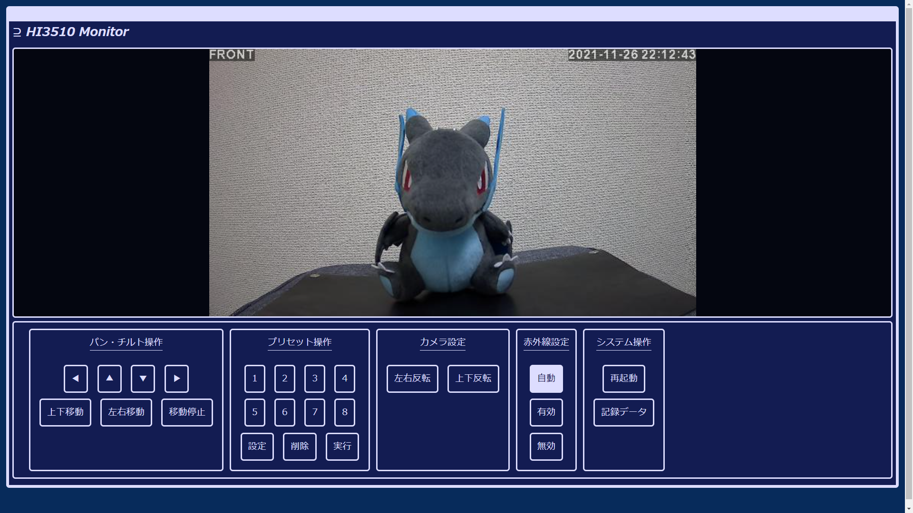

# **HI3510MON**
## **The web ui for IPCam which using HI3510.**
 - You can check captured image without Java, Flash and other install.
 - Easy control is also possible.
 - But not support voice and I'm not sure how to do it.

 

# **Environment**
 - Apache 2.4 or later.
 - PHP 7.4 or later or probably earlier.
 - Modern browsers these days. (Edge(chrome), chrome, firefox)

 

# **ATTENTION**
## **Authentication is not implemented.**
 - You have to protect this application with basic authentication or etc.
